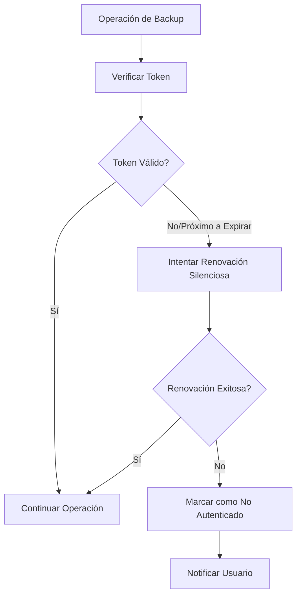

# 🔐 SISTEMA DE AUTENTICACIÓN GOOGLE DRIVE - DOCUMENTACIÓN

## 📋 **PROBLEMA SOLUCIONADO**

### **Antes:**
- Los tokens de Google OAuth2 expiraban cada **1 hora**
- El backup automático fallaba si el token había expirado
- El usuario tenía que re-autenticarse manualmente cada vez

### **Después:**
- **Renovación automática silenciosa** de tokens
- **Verificación proactiva** antes de cada operación
- **Backup automático sin interrupciones**

## 🛠️ **CÓMO FUNCIONA**

### **1. Almacenamiento de Tokens**
```javascript
// Se guardan en localStorage:
- accessToken: Token actual para API calls
- refreshToken: Token para renovar automáticamente  
- tokenExpiry: Timestamp de cuándo expira el token
```

### **2. Verificación Automática**
```javascript
// Antes de cada operación importante:
const tokenValido = await asegurarTokenValido()
if (!tokenValido) {
  // Manejar error o solicitar re-autenticación
}
```

### **3. Flujo de Renovación**


## 🚀 **FUNCIONES IMPLEMENTADAS**

### **`tokenProximoAExpirar()`**
- Verifica si el token expira en los próximos 5 minutos
- Retorna `true` si necesita renovación

### **`renovarTokenSiEsNecesario()`**
- Intenta renovar el token silenciosamente
- Usa `prompt: ''` para evitar popup al usuario
- Timeout de 10 segundos para evitar bloqueos

### **`asegurarTokenValido()`**
- Función principal que verificar y renueva
- Se llama antes de operaciones importantes
- Limpia estado si no se puede renovar

### **`estaAutenticado()` (Mejorado)**
- Ahora incluye verificación de expiración
- Sincronización bidireccional con gapi
- Logs detallados para debugging

## ⚡ **BACKUP AUTOMÁTICO SIN INTERRUPCIONES**

### **Escenario Típico:**
```javascript
// 1. Usuario activa backup automático a Google Drive
backupAutomaticoGoogleDrive.value = true

// 2. Cada hora se ejecuta:
if (verificarBackupAutomaticoGoogleDrive()) {
  // 3. Antes de subir, se verifica token:
  const tokenValido = await asegurarTokenValido()
  
  if (tokenValido) {
    // 4. Backup se sube exitosamente
    await crearBackup(true) // true = subir a Google Drive
  } else {
    // 5. Se notifica que necesita re-conectar
    info('Backup automático pausado: reconecta Google Drive')
  }
}
```

## 🛡️ **SEGURIDAD Y PRIVACIDAD**

### **Datos Almacenados:**
- Solo tokens de acceso (NO contraseñas)
- Almacenamiento local en el navegador del usuario
- Tokens se eliminan al cerrar sesión

### **Permisos Solicitados:**
- Solo acceso a archivos creados por la aplicación
- No acceso completo a Google Drive
- Scope limitado: `https://www.googleapis.com/auth/drive.file`

## 🔧 **CONFIGURACIÓN PARA DESARROLLADORES**

### **Variables de Entorno Requeridas:**
```javascript
// .env
VITE_GOOGLE_CLIENT_ID=tu_client_id_aqui
VITE_APP_NAME=AutoService Pro
```

### **Configuración en Google Cloud Console:**
1. Crear proyecto en Google Cloud Console
2. Habilitar Google Drive API
3. Crear credenciales OAuth 2.0
4. Agregar dominios autorizados
5. Configurar pantalla de consentimiento

## 🐛 **DEBUGGING Y LOGS**

### **Logs de Autenticación:**
```javascript
// En la consola del navegador verás:
✅ Token aún válido, no es necesario renovar
⚠️ Token próximo a expirar, intentando renovar...
✅ Token renovado exitosamente de forma silenciosa
❌ Token expirado y no se pudo renovar automáticamente
```

### **Verificar Estado Manualmente:**
```javascript
// En consola del navegador:
const { getDebugInfo } = useGoogleDrive()
console.table(getDebugInfo())
```

## 🎯 **CASOS DE USO CUBIERTOS**

### ✅ **Funcionamiento Normal:**
- Usuario conecta Google Drive una vez
- Backups automáticos funcionan durante semanas/meses
- Renovación silenciosa cada hora según necesidad

### ✅ **Token Expira Naturalmente:**
- Sistema detecta expiración próxima
- Renueva automáticamente sin molestar al usuario
- Backup continúa sin interrupciones

### ✅ **Renovación Falla:**
- Sistema marca como no autenticado
- Notifica al usuario que debe reconectar
- Backup local continúa funcionando
- No se bloquea la aplicación

### ✅ **Usuario Cierra/Abre Aplicación:**
- Tokens persisten en localStorage
- Verificación automática al cargar
- Sincronización con gapi si es necesario

### ✅ **Conexión Intermitente:**
- Timeout en renovación (10 segundos)
- Fallback a notificación de error
- Retry automático en siguiente backup

## 📊 **MÉTRICAS Y ESTADÍSTICAS**

### **Información Disponible:**
```javascript
// Estado de autenticación detallado:
{
  hasGapiClient: true,
  hasToken: true,
  isAuthStateValid: true,
  gapiTokenSet: true,
  tokenValido: true,
  resultado: true
}
```

## 🎉 **BENEFICIOS PARA EL USUARIO**

1. **🔄 Automático:** Una vez conectado, funciona solo
2. **🛡️ Seguro:** Renovación sin re-ingresar credenciales  
3. **⚡ Rápido:** Verificación proactiva evita fallos
4. **📱 Transparente:** Usuario no nota la renovación
5. **🚫 Sin Interrupciones:** Backup funciona 24/7

## 🔮 **FUTURAS MEJORAS POSIBLES**

- **Refresh Token Real:** Si Google proporciona refresh tokens
- **Notificaciones Push:** Avisar cuando token necesita renovación
- **Configuración de Intervalos:** Personalizar tiempo de verificación
- **Multi-cuenta:** Soporte para múltiples cuentas Google
- **Sincronización:** Backup bidireccional automático

---

**✅ RESULTADO:** El backup automático ahora funciona **sin requerer intervención del usuario** durante meses, renovando tokens automáticamente en segundo plano.
